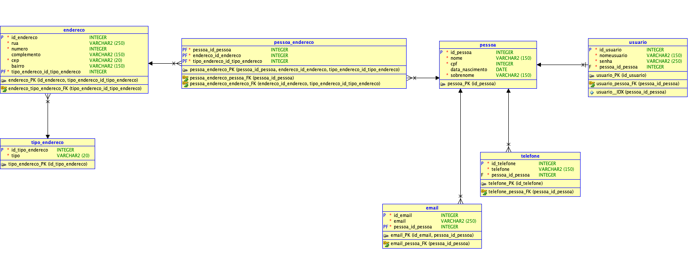

# Projeto CRUD Completo - Gerenciamento de Pessoas, Endereços e Usuários
Este projeto implementa um **CRUD completo** para gerenciar pessoas, endereços, telefones, emails e usuários, utilizando **Spring Boot**, **JPA/Hibernate** e banco de dados MySQL.  


## Modelagem Relacional do Projeto



## 📝 Descrição
O sistema permite:

- Criar, atualizar, consultar e deletar pessoas.
- Associar múltiplos emails e telefones a uma pessoa.
- Gerenciar endereços com tipos (residencial, comercial, etc.).
- Criar usuários vinculados a pessoas para autenticação.


## 🔹 Exemplos de JSON para testes

### Criar pessoa
```json
{
  "nome": "Cintia",
  "sobrenome": "Angelo",
  "cpf": 32737439293,
  "data_nascimento": "2005-03-05"
}
```
### Criar Tipo de Endereco
```json
{
  "tipo": "Comercial"
}
```
### Criar Endereco
```json
{
  "rua": "Rua Nova",
  "numero": 43,
  "cep": "433232-644",
  "bairro": "Jardim Casa Nova",
  "tipoEnderecoId": 1
}
```
